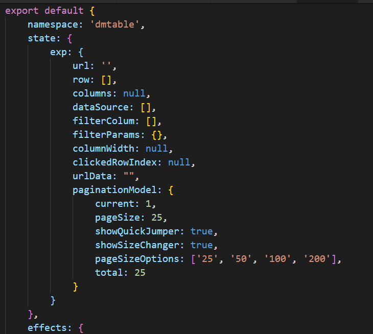

# react ant design pro 使用技巧

#### 1.componentwillreceiveprops  使用需要加判断

原因:每当组件的props变化时,componentwillreceiveprops 总是被调用,如果里面有dispatch或者setState之类的方法,那么会无限被调用,尤其是setState,就会爆出无限循环的错误,因此,更新时需要确认状态,如下图,这样就能保证操作只执行一次

#### 2.dispatch then

原因:dispatch 执行成功后,想要根据传回的值进行操作

1.首先在effect中写入return

2.可以使用then了,then中的res值就是return回来的值

#### 3.render中不要写除props,state,以外的const的东西,要写在constructor中

原因:每次render都会const一堆常亮,开辟新的内存地址,损耗硬件性能,const应该是初始化一遍,直到组件卸载或者关闭浏览器才消失的

1.像图一这种一成不变的就可以提到组件的class之外

2.像这种需要使用this的,提升到class外面是找不到this的,可以放到constructor中

#### 4.不一定非要每个组件都链接model,适当情况下可以组件直连service,这样就避免了redux互相影响的问题

原因:目前DM和MSAPP都遇到的问题,以table为例,连接redux之后如果被多个页面引用,redux会互相影响,一处改变,全都变化,尤其是DM这种有tab页的,更加明显

目前DM解决方法:

1.首先在model中设置state时,写一个模板

2.组件使用时写一个dataNameSpace属性

3.在组件初始化时将model的state复制一份到当前dataNameSpace下,以后所有的操作都只在当前dataNameSpace下进行,可以保证不同dataNameSpace之间不会互相影响

弊端:1.要多些很多逻辑,容易出错,

2.每次dispatch要带上dataNameSpace,

3.法保证dataNameSpace的唯一性

解决方法:是否可以抛开ant design pro的束缚,使组件直接调用service,不再连接model,毕竟model只是为了全局控制,而state可以做到每次使用组件都会初始化一份自己的

#### 5.bind的另一种写法 
{ handlerClick(i) } }>点击我呀!

原因:很多方法传参时需要使用bind方法,

现在可以 
{ handlerClick(i) } }>使用这种es6加闭包的方法,效果一样

#### 6.修改redux值要使用{...abc}复制一份,但是只是浅复制js没有深复制,需要用immer之类的库

#### 7.react16 新生命周期函数 getDerivedStateFromProps 可以判断state变化

 https://www.jianshu.com/p/50fe3fb9f7c3

#### 8.react16 新生命周期函数 componentDidCatch

https://www.cnblogs.com/yf-html/p/9294737.html

16以前生命周期

16以后生命周期

#### 9.函数柯里化

 https://www.jianshu.com/p/2975c25e4d71